# System Architecture Analysis
<!-- generated in 0.00s -->

## Overview

- **Project**: /home/tom/github/tom-sapletta-com/cyberdsl
- **Primary Language**: yaml
- **Languages**: yaml: 15, python: 9, toml: 1, shell: 1, javascript: 1
- **Analysis Mode**: static
- **Total Functions**: 134
- **Total Classes**: 10
- **Modules**: 27
- **Entry Points**: 90

## Architecture by Module

### cyberdsl.static.app
- **Functions**: 78
- **File**: `app.js`

### cyberdsl.models
- **Functions**: 22
- **Classes**: 4
- **File**: `models.py`

### cyberdsl.webapp
- **Functions**: 17
- **File**: `webapp.py`

### cyberdsl.__main__
- **Functions**: 9
- **File**: `__main__.py`

### cyberdsl.parser
- **Functions**: 8
- **Classes**: 5
- **File**: `parser.py`

### examples.family_simulation
- **Functions**: 7
- **File**: `family_simulation.py`

### cyberdsl.dashboard
- **Functions**: 6
- **File**: `dashboard.py`

### cyberdsl.graph
- **Functions**: 5
- **File**: `graph.py`

### cyberdsl.litellm_adapter
- **Functions**: 3
- **Classes**: 1
- **File**: `litellm_adapter.py`

## Key Entry Points

Main execution flows into the system:

### cyberdsl.__main__.main
- **Calls**: argparse.ArgumentParser, parser.add_subparsers, sub.add_parser, p.add_argument, p.add_argument, p.set_defaults, sub.add_parser, p.add_argument

### examples.family_simulation.scenario_divorce
> Miesiące 1-12:  narastający konflikt (jak scenariusz B).
Miesiąc 13:     separacja — silny szok systemowy.
Miesiące 14-30: adaptacja, dzieci w terapii
- **Calls**: examples.family_simulation.fresh_sim, sim.set_global, sim.set_global, sim.set_global, range, sim.step, timeline.append, sim.apply_shock

### cyberdsl.webapp.handle_simulate_stream
> SSE endpoint: sends one JSON event per simulation step.
- **Calls**: web.StreamResponse, Simulation, log.info, json.dumps, range, json.dumps, log.info, None.strip

### cyberdsl.static.app.streamSimulation
- **Calls**: cyberdsl.static.app.trim, cyberdsl.static.app.setBadge, cyberdsl.static.app.clearError, cyberdsl.static.app.clearResults, cyberdsl.static.app.setButtons, cyberdsl.static.app.remove, cyberdsl.static.app.log, cyberdsl.static.app.fetch

### cyberdsl.models.SimulationResult.to_csv
> Export timeline as CSV (step, observable_*, node_*_var columns).
- **Calls**: io.StringIO, sorted, sorted, csv.writer, writer.writerow, buf.getvalue, None.keys, None.items

### cyberdsl.webapp.handle_simulate
- **Calls**: None.strip, body.get, cyberdsl.webapp._parse_model, None.run, log.info, web.json_response, request.json, body.get

### cyberdsl.static.app.reader
- **Calls**: cyberdsl.static.app.read, cyberdsl.static.app.decode, cyberdsl.static.app.split, cyberdsl.static.app.pop, cyberdsl.static.app.trim, cyberdsl.static.app.startsWith, cyberdsl.static.app.slice, cyberdsl.static.app.parse

### cyberdsl.static.app.decoder
- **Calls**: cyberdsl.static.app.read, cyberdsl.static.app.decode, cyberdsl.static.app.split, cyberdsl.static.app.pop, cyberdsl.static.app.trim, cyberdsl.static.app.startsWith, cyberdsl.static.app.slice, cyberdsl.static.app.parse

### cyberdsl.static.app.totalSteps
- **Calls**: cyberdsl.static.app.read, cyberdsl.static.app.decode, cyberdsl.static.app.split, cyberdsl.static.app.pop, cyberdsl.static.app.trim, cyberdsl.static.app.startsWith, cyberdsl.static.app.slice, cyberdsl.static.app.parse

### examples.family_simulation.scenario_crisis
> Rosnący stres ekonomiczny, utrata pracy ojca w miesiącu 8.
- **Calls**: examples.family_simulation.fresh_sim, sim.set_global, sim.set_global, sim.set_global, range, sim.step, timeline.append, sim.set_global

### examples.family_simulation.print_report
- **Calls**: print, print, print, print, print, OBSERVABLES_LABELS.items, print, print

### cyberdsl.models.MonteCarloResult.percentile_observable
> Return step-by-step p-th percentile (0‥100) of observable.
- **Calls**: range, vals.sort, max, result.append, result.append, len, None.get, isinstance

### cyberdsl.static.app.runSimulation
- **Calls**: cyberdsl.static.app.trim, cyberdsl.static.app.setBadge, cyberdsl.static.app.clearError, cyberdsl.static.app.clearResults, cyberdsl.static.app.setButtons, cyberdsl.static.app.log, cyberdsl.static.app.fetch, cyberdsl.static.app.stringify

### cyberdsl.models.SimulationResult.summary
- **Calls**: lines.append, None.items, lines.append, None.items, None.join, lines.append, None.join, lines.append

### cyberdsl.litellm_adapter.CommunityDSLTranslator.translate
> Translate a natural-language description into CyberDSL text.

Args:
    description: Free-form description of the social system.
    schema_hint:  Opt
- **Calls**: messages.append, completion, None.message.content.strip, raw.startswith, raw.strip, raw.splitlines, None.join, RuntimeError

### cyberdsl.webapp.handle_parse
- **Calls**: None.strip, body.get, cyberdsl.webapp._parse_model, log.info, web.json_response, request.json, web.json_response, len

### cyberdsl.webapp.handle_mermaid
- **Calls**: None.strip, body.get, body.get, cyberdsl.webapp._parse_model, cyberdsl.graph.model_to_mermaid, log.info, web.json_response, request.json

### cyberdsl.static.app.parts
- **Calls**: cyberdsl.static.app.trim, cyberdsl.static.app.startsWith, cyberdsl.static.app.slice, cyberdsl.static.app.parse, cyberdsl.static.app.log, cyberdsl.static.app.renderMermaid, cyberdsl.static.app.renderModelInfo, cyberdsl.static.app.initStreamCharts

### cyberdsl.__main__.cmd_monte
- **Calls**: cyberdsl.__main__._load_model, cyberdsl.models.run_monte_carlo, cyberdsl.__main__._load_model, None.run, cyberdsl.dashboard.save_dashboard, print, print, print

### cyberdsl.__main__.cmd_translate
- **Calls**: None.read, CommunityDSLTranslator, t.translate, print, print, print, sys.exit, open

### examples.family_simulation.print_comparison
> Porównanie końcowych wartości obserwabli między scenariuszami.
- **Calls**: print, print, print, print, print, OBSERVABLES_LABELS.items, None.join, print

### examples.family_simulation.scenario_stable
> Niska presja zewnętrzna, sporadyczna terapia, dobre wsparcie społeczne.
- **Calls**: examples.family_simulation.fresh_sim, sim.set_global, sim.set_global, sim.set_global, range, sim.step, timeline.append, sim.set_global

### cyberdsl.static.app.loadExampleList
- **Calls**: cyberdsl.static.app.fetch, cyberdsl.static.app.json, cyberdsl.static.app.log, cyberdsl.static.app.forEach, cyberdsl.static.app.push, cyberdsl.static.app.entries, cyberdsl.static.app.createElement, cyberdsl.static.app.appendChild

### cyberdsl.__main__.cmd_dashboard
- **Calls**: cyberdsl.__main__._load_model, Simulation, sim.run, cyberdsl.dashboard.save_dashboard, print, print, result.summary, args.model.rsplit

### cyberdsl.__main__.cmd_csv
- **Calls**: cyberdsl.__main__._load_model, Simulation, sim.run, result.save_csv, print, print, result.summary, args.model.rsplit

### cyberdsl.__main__.cmd_visualize
- **Calls**: cyberdsl.__main__._load_model, cyberdsl.graph.save_mermaid, print, None.read, cyberdsl.graph.save_graph_viewer, print, args.model.rsplit, open

### cyberdsl.static.app._mmdCounter
- **Calls**: cyberdsl.static.app.replace, cyberdsl.static.app.log, cyberdsl.static.app.remove, cyberdsl.static.app.getElementById, cyberdsl.static.app.render, cyberdsl.static.app.error, cyberdsl.static.app.String, cyberdsl.static.app.slice

### cyberdsl.models.Simulation._eval_rules
> Calculate new states atomically.
- **Calls**: copy.deepcopy, self.model.nodes.get, self._states.get, self._build_signals, eval, float, new_states.setdefault

### cyberdsl.models.Simulation.run_scenario
> Run with scheduled interventions.

shock_at:  {step_no: [(node_id, var, delta), ...]}
global_at: {step_no: {key: value}}
- **Calls**: SimulationResult, range, self.step, result.timeline.append, None.items, self.apply_shock, self.set_global

### cyberdsl.static.app.name
- **Calls**: cyberdsl.static.app.fetch, cyberdsl.static.app.encodeURIComponent, cyberdsl.static.app.json, cyberdsl.static.app.showError, cyberdsl.static.app.clearResults, cyberdsl.static.app.parseModel, cyberdsl.static.app.String

## Process Flows

Key execution flows identified:

### Flow 1: main
```
main [cyberdsl.__main__]
```

### Flow 2: scenario_divorce
```
scenario_divorce [examples.family_simulation]
  └─> fresh_sim
```

### Flow 3: handle_simulate_stream
```
handle_simulate_stream [cyberdsl.webapp]
```

### Flow 4: streamSimulation
```
streamSimulation [cyberdsl.static.app]
  └─> setBadge
```

### Flow 5: to_csv
```
to_csv [cyberdsl.models.SimulationResult]
```

### Flow 6: handle_simulate
```
handle_simulate [cyberdsl.webapp]
  └─> _parse_model
      └─ →> parse_yaml
```

### Flow 7: reader
```
reader [cyberdsl.static.app]
```

### Flow 8: decoder
```
decoder [cyberdsl.static.app]
```

### Flow 9: totalSteps
```
totalSteps [cyberdsl.static.app]
```

### Flow 10: scenario_crisis
```
scenario_crisis [examples.family_simulation]
  └─> fresh_sim
```

## Key Classes

### cyberdsl.models.Simulation
- **Methods**: 10
- **Key Methods**: cyberdsl.models.Simulation.__init__, cyberdsl.models.Simulation._build_signals, cyberdsl.models.Simulation._push_signals, cyberdsl.models.Simulation._eval_rules, cyberdsl.models.Simulation._eval_observables, cyberdsl.models.Simulation.step, cyberdsl.models.Simulation.run, cyberdsl.models.Simulation.apply_shock, cyberdsl.models.Simulation.set_global, cyberdsl.models.Simulation.run_scenario

### cyberdsl.models.SimulationResult
- **Methods**: 5
- **Key Methods**: cyberdsl.models.SimulationResult.observables_over_time, cyberdsl.models.SimulationResult.node_state_over_time, cyberdsl.models.SimulationResult.summary, cyberdsl.models.SimulationResult.to_csv, cyberdsl.models.SimulationResult.save_csv

### cyberdsl.models.MonteCarloResult
- **Methods**: 3
- **Key Methods**: cyberdsl.models.MonteCarloResult.mean_observable, cyberdsl.models.MonteCarloResult.std_observable, cyberdsl.models.MonteCarloResult.percentile_observable

### cyberdsl.litellm_adapter.CommunityDSLTranslator
- **Methods**: 3
- **Key Methods**: cyberdsl.litellm_adapter.CommunityDSLTranslator.__init__, cyberdsl.litellm_adapter.CommunityDSLTranslator.translate, cyberdsl.litellm_adapter.CommunityDSLTranslator.translate_and_compile

### cyberdsl.models.ModelCompiler
- **Methods**: 2
- **Key Methods**: cyberdsl.models.ModelCompiler.parse, cyberdsl.models.ModelCompiler._validate

### cyberdsl.parser.NodeDef
- **Methods**: 0

### cyberdsl.parser.EdgeDef
- **Methods**: 0

### cyberdsl.parser.RuleDef
- **Methods**: 0

### cyberdsl.parser.ModelDef
- **Methods**: 0

### cyberdsl.parser.ParseError
- **Methods**: 0
- **Inherits**: Exception

## Data Transformation Functions

Key functions that process and transform data:

### cyberdsl.parser._parse_dict_literal
> Parse {k:v, k:v} into dict. Values coerced to float.
- **Output to**: s.strip, s.startswith, s.endswith, s.split, pair.strip

### cyberdsl.parser._parse_value
- **Output to**: v.strip, v.startswith, v.startswith, cyberdsl.parser._parse_dict_literal, v.strip

### cyberdsl.parser._parse_node_line
> youth:group | state={cohesion:0.45, trust:0.40} | adaptability=0.70
- **Output to**: NodeDef, p.strip, id_kind.split, attr.split, line.split

### cyberdsl.parser._parse_edge_line
> council->youth:influence | weight=0.30 | delay=1
- **Output to**: re.match, EdgeDef, p.strip, ParseError, m.group

### cyberdsl.parser.parse_dsl
> Parse CyberDSL text into a ModelDef.
- **Output to**: ModelDef, text.splitlines, cyberdsl.parser._strip_inline_comment, line.strip, re.match

### cyberdsl.parser.parse_yaml
> Parse a CyberDSL YAML representation into a ModelDef.
- **Output to**: yaml.safe_load, ModelDef, data.get, str, int

### cyberdsl.models.ModelCompiler.parse
- **Output to**: cyberdsl.parser.parse_dsl, self._validate

### cyberdsl.models.ModelCompiler._validate
- **Output to**: set, ValueError, set, ValueError

### cyberdsl.webapp._parse_model
> Parse DSL or YAML text, return ModelDef.
- **Output to**: None.parse, cyberdsl.parser.parse_yaml, ModelCompiler

### cyberdsl.webapp.handle_parse
- **Output to**: None.strip, body.get, cyberdsl.webapp._parse_model, log.info, web.json_response

### cyberdsl.static.app.parseModel
- **Output to**: cyberdsl.static.app.clearError, cyberdsl.static.app.trim, cyberdsl.static.app.setBadge, cyberdsl.static.app.log, cyberdsl.static.app.fetch

### cyberdsl.static.app.decoder
- **Output to**: cyberdsl.static.app.read, cyberdsl.static.app.decode, cyberdsl.static.app.split, cyberdsl.static.app.pop, cyberdsl.static.app.trim

## Public API Surface

Functions exposed as public API (no underscore prefix):

- `cyberdsl.__main__.main` - 42 calls
- `cyberdsl.parser.parse_yaml` - 42 calls
- `examples.family_simulation.scenario_divorce` - 40 calls
- `cyberdsl.parser.parse_dsl` - 32 calls
- `cyberdsl.webapp.handle_simulate_stream` - 32 calls
- `cyberdsl.static.app.streamSimulation` - 29 calls
- `cyberdsl.models.SimulationResult.to_csv` - 19 calls
- `cyberdsl.webapp.handle_simulate` - 19 calls
- `cyberdsl.dashboard.build_dashboard` - 18 calls
- `cyberdsl.graph.build_graph_viewer` - 18 calls
- `cyberdsl.static.app.reader` - 16 calls
- `cyberdsl.static.app.decoder` - 16 calls
- `cyberdsl.static.app.totalSteps` - 16 calls
- `examples.family_simulation.scenario_crisis` - 15 calls
- `examples.family_simulation.print_report` - 15 calls
- `cyberdsl.models.MonteCarloResult.percentile_observable` - 15 calls
- `cyberdsl.static.app.runSimulation` - 15 calls
- `cyberdsl.graph.model_to_mermaid` - 13 calls
- `cyberdsl.models.SimulationResult.summary` - 13 calls
- `cyberdsl.litellm_adapter.CommunityDSLTranslator.translate` - 13 calls
- `cyberdsl.webapp.handle_parse` - 13 calls
- `cyberdsl.webapp.handle_mermaid` - 13 calls
- `cyberdsl.static.app.renderAllCharts` - 13 calls
- `cyberdsl.static.app.initStreamCharts` - 13 calls
- `cyberdsl.models.run_monte_carlo` - 12 calls
- `cyberdsl.static.app.parseModel` - 12 calls
- `cyberdsl.static.app.parts` - 12 calls
- `cyberdsl.__main__.cmd_monte` - 11 calls
- `cyberdsl.__main__.cmd_translate` - 11 calls
- `examples.family_simulation.print_comparison` - 10 calls
- `cyberdsl.webapp.create_app` - 10 calls
- `examples.family_simulation.scenario_stable` - 9 calls
- `cyberdsl.static.app.loadExampleList` - 9 calls
- `cyberdsl.__main__.cmd_dashboard` - 8 calls
- `cyberdsl.__main__.cmd_csv` - 8 calls
- `cyberdsl.__main__.cmd_visualize` - 8 calls
- `cyberdsl.static.app.renderMermaid` - 8 calls
- `cyberdsl.static.app.renderModelInfo` - 8 calls
- `cyberdsl.models.Simulation.run_scenario` - 7 calls
- `cyberdsl.static.app.name` - 7 calls

## System Interactions

How components interact:

```mermaid
graph TD
    main --> ArgumentParser
    main --> add_subparsers
    main --> add_parser
    main --> add_argument
    scenario_divorce --> fresh_sim
    scenario_divorce --> set_global
    scenario_divorce --> range
    handle_simulate_stre --> StreamResponse
    handle_simulate_stre --> Simulation
    handle_simulate_stre --> info
    handle_simulate_stre --> dumps
    handle_simulate_stre --> range
    streamSimulation --> trim
    streamSimulation --> setBadge
    streamSimulation --> clearError
    streamSimulation --> clearResults
    streamSimulation --> setButtons
    to_csv --> StringIO
    to_csv --> sorted
    to_csv --> writer
    to_csv --> writerow
    handle_simulate --> strip
    handle_simulate --> get
    handle_simulate --> _parse_model
    handle_simulate --> run
    handle_simulate --> info
    reader --> read
    reader --> decode
    reader --> split
    reader --> pop
```



## Reverse Engineering Guidelines

1. **Entry Points**: Start analysis from the entry points listed above
2. **Core Logic**: Focus on classes with many methods
3. **Data Flow**: Follow data transformation functions
4. **Process Flows**: Use the flow diagrams for execution paths
5. **API Surface**: Public API functions reveal the interface

## Context for LLM

Maintain the identified architectural patterns and public API surface when suggesting changes.